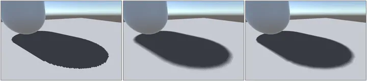
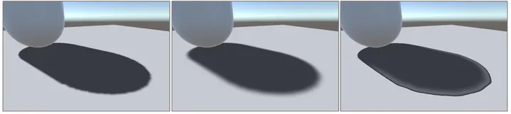
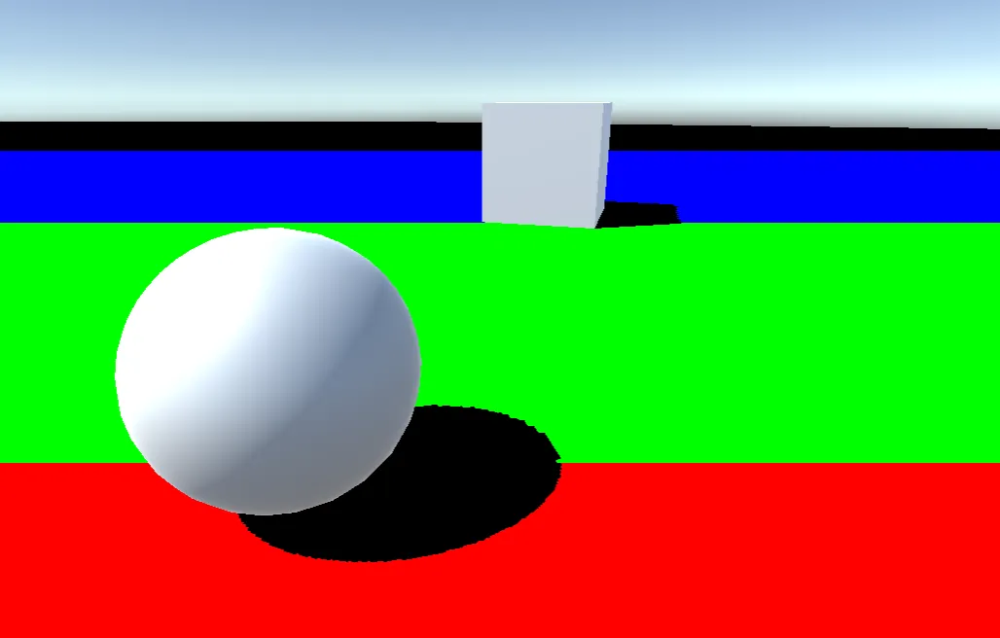
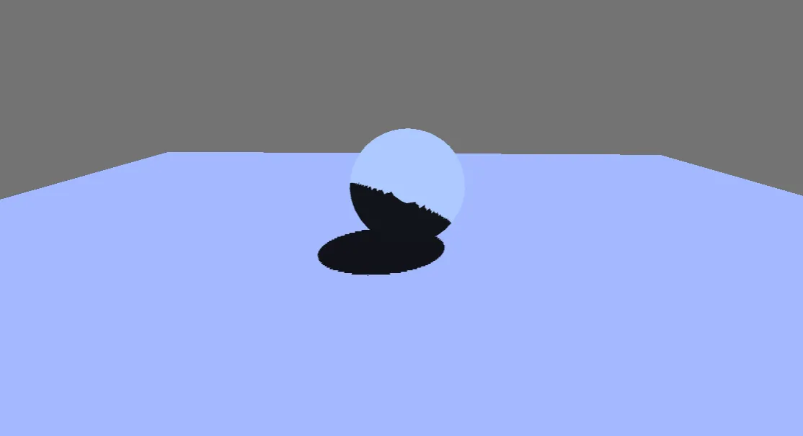

#

Unity的实时阴影实现，包括：

1) Shadow Mapping系列的重采样方法，包括Hard、PCF、PCSS、VSM、VSSM、MOMENT。
2) CSM（Cascaded Shadow Mapping, 级联阴影映射）
3) SSSM（Screen Space Shadow Mapping, 屏幕空间阴影映射）

Unity's real-time shadow implementation, including:

1) Resampling Methods for Shadow Mapping Series, including Hard, PCF, PCSS, VSM, VSSM, MOMENT.
2) CSM (Cascaded Shadow Mapping)
3) SSSM (Screen Space Shadow Mapping)

Unity version：2022.3.40f1c1

||
|:-:|
|HARD-PCF-PCSS|

||
|:-:|
|VSM-VSSM-MOMENT|

||
|:-:|
|CSSM 级联阴影映射|

||
|:-:|
|SSSM 屏幕空间阴影映射|
